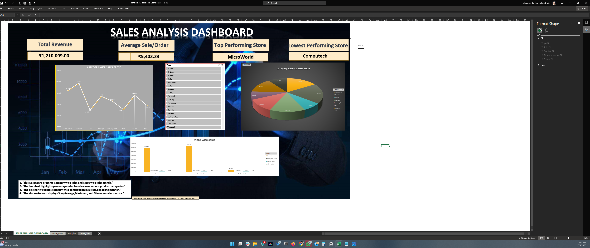

# 📊 Sales Analysis Dashboard (Excel Portfolio Project)

## 💡 Overview
This project is a comprehensive **Excel Dashboard** that analyzes sales data across various product categories and store locations. It highlights trends, key metrics, and interactive insights using slicers and charts.

I built this dashboard from scratch, resolved issues with hidden data, added KPIs, and transformed a raw Excel sheet into a fully interactive business tool.

---

## 🛠️ Tools & Skills Used
- **Microsoft Excel**
- Pivot Tables & Charts
- Slicers (Town-wise filters)
- KPI Cards (with dynamic formulas)
- Conditional Formatting
- Data Cleaning (`TRIM`, `INDEX-MATCH`)
- Visual Design & Dashboard Layouting

---

## 📌 Features Included
- 📈 **Category-wise Sales Trend (Line Chart)**  
  Shows percentage sales across categories with clear data labels.

- 🧩 **Category-wise Contribution (Pie Chart)**  
  Highlights each category's share of total sales.

- 🏬 **Store-wise Sales Metrics (Bar Chart + Table)**  
  Displays Total, Average, Maximum, and Minimum Sales for each store.

- 💡 **Dynamic KPI Cards**  
  - Total Revenue  
  - Average Sale per Order  
  - Top Performing Store  
  - Lowest Performing Store

- 🎛️ **Interactive Town Filter (Slicer)**  
  Easily filter all visuals by town to analyze localized sales performance.

---

## 📖 Case Study Summary

> Initially, the raw dataset was missing a store ("Technologia"), which caused gaps in pivot charts. After investigating hidden filters and using `TRIM` to clean store names, I fixed the issue and restored accurate visualizations.

I also customized the layout with a background image, used consistent color themes, added proper currency formatting (₹), and wrote explanations to make the dashboard **interview-ready** and client-presentable.

---

## 📸 Preview

> *(Note: For full interactivity, download the Excel file and open in Microsoft Excel)*

---

## 📂 Files Included

- `Final_Excel_portfolio_Dashboard.xlsx` – Interactive dashboard file  
- `README.md` – Documentation (you’re reading it!)  
- `Screenshot_dashboard.png` – Preview image of the dashboard
- 
📌 **Note**: If you see a warning like "File format and extension don't match," it's safe to open. The file is clean and works perfectly in Excel Desktop.

---

## 🧑‍💻 About Me

I'm **Rama Chandrudu**, passionate about Data Analytics, transitioning from an operations support role to data-driven storytelling and decision making. This is one of the projects that showcases my Excel skills.

> _“I believe clean visuals + strong logic = great insights.”_

---

